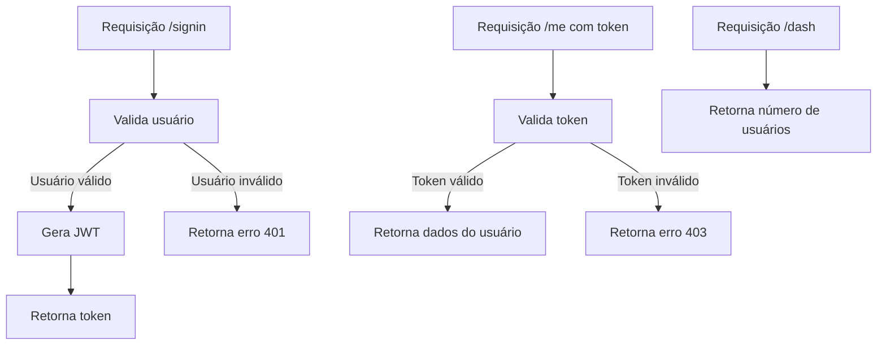
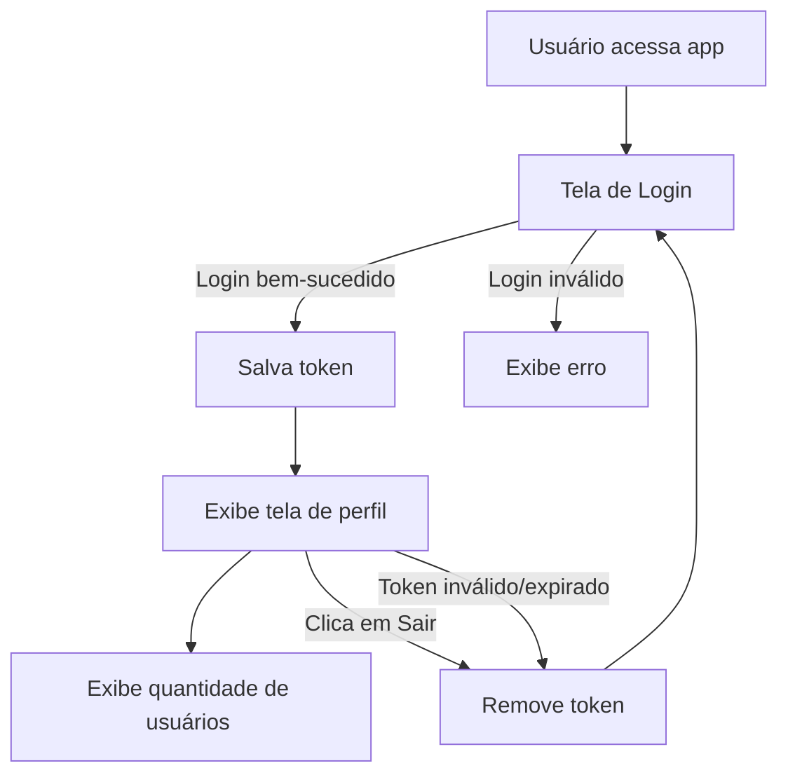

# Sistema de login com React e Node.js (JWT)

> Aplicação didática com autenticação JWT: API Express com rotas protegidas por middleware e cliente React/Vite com login, perfil e dashboard.

   

Material preparado em janeiro de 2026 para uma aula-teste de processo seletivo docente. O backend expõe `POST /signin`, `GET /me` (protegida) e `GET /dash`; o frontend guarda o token em `localStorage` e alterna entre as telas conforme a autenticação.

## Estrutura de pastas
```text
backend/src/index.js        rotas e geração do token
backend/src/middleware.js   authorizeToken (Bearer)
backend/src/users.js        usuários em memória
frontend/src/               App, Login, Profile, Dash
```

## Tema da avaliação

**Tema de aula teste:**

Desenvolvimento de um sistema de login com React e Node.js: Autenticação JWT, rotas protegidas e boas práticas de segurança.

O(a) candidato(a) deverá demonstrar, de forma prática e didática, o desenvolvimento de um sistema básico de login utilizando React no front-end e Node.js com Express.js no back-end.

**A apresentação deve abordar:**

- O fluxo de autenticação (login, logout e persistência do usuário).
- Proteção de rotas no front-end (React Router, Context ou Hooks).
- Autenticação com JWT no back-end.
- Boas práticas de segurança e organização do código.
- Demonstração funcional e explicação didática das etapas de desenvolvimento.

## Fluxo do Backend (Mermaid)



## Instalação dos pacotes backend

No diretório `backend`, execute:

```bash
npm install cors express dotenv http-status-codes jsonwebtoken
```


## Rodando o backend

No diretório `backend`, execute:

```bash
node src/index.js
```

---

## Fluxo do Frontend (Mermaid)



## Instalação dos pacotes frontend (React)

No diretório `frontend`, execute:

```bash
npm install react react-dom vite
```

## Rodando o frontend

No diretório `frontend`, execute:

```bash
npm run dev
```

O frontend estará disponível em `http://localhost:5173` (padrão Vite).

## Status
Concluído (material de aula).

## Autor
Ronildo Silva · ronildo.comp@gmail.com
